# 📋 Evidence Pack — Dự Án GitOps App-of-Apps & Canary Deployment

> **Sinh viên**: Nguyễn Phú Tài  
> **GitHub Repository**: [https://github.com/ddor2812-dev/gitops](https://github.com/ddor2812-dev/gitops)  
> **Ngày thu thập**: 2026-06-12 09:41 (GMT+7)  
> **Cluster**: Minikube profile `w9` — Kubernetes v1.35.1

---

## Mục Lục

1. [Tổng quan dự án & Yêu cầu đề bài](#1-tổng-quan-dự-án--yêu-cầu-đề-bài)
2. [Kiến trúc hệ thống](#2-kiến-trúc-hệ-thống)
3. [Bằng chứng cơ sở hạ tầng (Infrastructure Evidence)](#3-bằng-chứng-cơ-sở-hạ-tầng)
   - [3.5. Bằng chứng Chuỗi Lab Cơ Bản (Lab 2 - Lab 7)](#35-bằng-chứng-chuỗi-lab-cơ-bản-gitops--app-of-apps)
4. [Bằng chứng Lab 1 — Prometheus Stack & Argo Rollouts](#4-bằng-chứng-lab-1--prometheus-stack--argo-rollouts)
5. [Bằng chứng Lab 2 — Flask API với Prometheus Metrics](#5-bằng-chứng-lab-2--flask-api-với-prometheus-metrics)
6. [Bằng chứng Lab 3 — Canary Rollout & ServiceMonitor](#6-bằng-chứng-lab-3--canary-rollout--servicemonitor)
7. [Bằng chứng Lab 4 — Canary tự động & SLO/Alert](#7-bằng-chứng-lab-4--canary-tự-động--sloalert)
8. [Đối chiếu tiêu chí chấm điểm](#8-đối-chiếu-tiêu-chí-chấm-điểm)
9. [Danh sách tất cả file trong dự án](#9-danh-sách-tất-cả-file-trong-dự-án)
10. [Lịch sử Git đầy đủ](#10-lịch-sử-git-đầy-đủ)

---

## 1. Tổng Quan Dự Án & Yêu Cầu Đề Bài

### Đề bài: Đưa bản mới `api` ra an toàn & tự bảo vệ

Dự án yêu cầu xây dựng hệ thống triển khai tự động hóa với 3 tiêu chí chính:

| # | Tiêu chí | Yêu cầu | Trạng thái |
|---|----------|----------|:----------:|
| 1 | **Qua Git** | Mọi thay đổi qua Git (ArgoCD Synced, no drift), `git revert` rollback < 5 phút | ✅ Đạt |
| 2 | **Đo lường** | 1 SLO + 1 alert fire → gửi email cá nhân khi chất lượng tụt | ✅ Đạt |
| 3 | **Canary tự động** | Thay `pause` tay bằng `AnalysisTemplate`; bản tốt → 100%; bản lỗi → tự abort | ✅ Đạt |

### Xuất phát (đã có từ lab trước)

- ArgoCD + Prometheus/Grafana + Argo Rollouts
- `api` đã là Rollout (canary `pause` thủ công)
- Học viên chỉ tự động hoá + đo lường + chứng minh

### Pipeline tổng quan

```
Đổi version qua Git → canary thả dần → metric/SLO tự chấm
→ tốt thì lên 100%, tệ thì tự rollback. Ship smartly.

┌──────────────┐      ┌──────────────────┐      ┌─────────────────┐
│   GitOps     │ ───▶ │  Observability   │ ───▶ │     Canary      │
│ đổi qua Git  │      │ metric/SLO chăm  │      │ thả dần, tệ thì│
│ tự sync      │      │ sóc/bệnh         │      │ auto-abort      │
└──────────────┘      └──────────────────┘      └─────────────────┘
```

---

## 2. Kiến Trúc Hệ Thống

### Sơ đồ kiến trúc tổng thể

```
┌──────────────────────────────────────────────────────────────────────────────┐
│                     CỤM KUBERNETES — Minikube (w9)                          │
│                     K8s v1.35.1 │ Docker Runtime                            │
│                                                                              │
│  ┌─── namespace: argocd ────────────────────────────────────────────────┐    │
│  │  Root App ──▶ web │ frontend │ backend │ api │ prometheus │ rollouts │    │
│  └──────────────────────────────────────────────────────────────────────┘    │
│                                                                              │
│  ┌─── namespace: demo ──────────────────────────────────────────────────┐   │
│  │  web (2 pods) │ frontend (1 pod) │ backend (1 pod) │ api (4 pods)   │   │
│  │  ServiceMonitor: api-monitor │ PrometheusRule: api-alerts            │   │
│  │  AnalysisTemplate: success-rate                                      │   │
│  └──────────────────────────────────────────────────────────────────────┘   │
│                                                                              │
│  ┌─── namespace: monitoring ────────────────────────────────────────────┐   │
│  │  Prometheus │ Grafana │ AlertManager │ Node Exporter │ Kube State    │   │
│  └──────────────────────────────────────────────────────────────────────┘   │
│                                                                              │
│  ┌─── namespace: argo-rollouts ─────────────────────────────────────────┐   │
│  │  Argo Rollouts Controller (2 pods HA)                                 │   │
│  └──────────────────────────────────────────────────────────────────────┘   │
└──────────────────────────────────────────────────────────────────────────────┘
```

### Cấu trúc thư mục dự án

```
gitops/
├── README.md                          # Tài liệu chi tiết dự án cơ bản (App-of-Apps)
├── LABS.md                            # Tài liệu chi tiết 4 bài Lab nâng cao
├── EVIDENCE_PACK.md                   # Bộ bằng chứng (file này)
├── .github/workflows/validate.yml     # CI Pipeline kiểm tra YAML
├── app/
│   ├── app.py                         # Flask API với Prometheus metrics
│   └── Dockerfile                     # Docker image cho API
├── argocd/
│   ├── root.yaml                      # Root Application (App-of-Apps)
│   └── apps/
│       ├── web.yaml                   # App con: Nginx web
│       ├── frontend.yaml              # App con: Frontend UI
│       ├── backend.yaml               # App con: Backend http-echo
│       ├── api.yaml                   # App con: Flask API Rollout
│       ├── kube-prometheus-stack.yaml  # App con: Prometheus + Grafana + AlertManager
│       └── argo-rollouts.yaml         # App con: Argo Rollouts Controller
├── k8s/
│   ├── web/
│   │   ├── namespace.yaml             # Namespace "demo"
│   │   └── web.yaml                   # ConfigMap + Deployment + Service
│   ├── frontend/
│   │   └── frontend.yaml              # HTML + Nginx proxy + Deployment + Service
│   └── backend/
│       └── backend.yaml               # http-echo + Deployment + Service
└── k8s-api/
    ├── api.yaml                       # Rollout (CRD) + Service
    ├── servicemonitor.yaml            # Prometheus scrape config
    ├── analysistemplate.yaml          # SLO: success_rate >= 95%
    └── prometheusrule.yaml            # Alert: error_rate > 5% → email
```

---

## 3. Bằng Chứng Cơ Sở Hạ Tầng

### 3.1. Minikube Cluster

> 📸 **Ảnh chụp terminal**: `minikube profile list`
>
> 

```
┌──────────┬────────┬─────────┬──────────────┬─────────┬────────┬───────┐
│ PROFILE  │ DRIVER │ RUNTIME │      IP      │ VERSION │ STATUS │ NODES │
├──────────┼────────┼─────────┼──────────────┼─────────┼────────┼───────┤
│ w9       │ docker │ docker  │ 192.168.58.2 │ v1.35.1 │ OK     │ 1     │
└──────────┴────────┴─────────┴──────────────┴─────────┴────────┴───────┘
```

### 3.2. Kubernetes Version

```
Client Version: v1.36.1
Server Version: v1.35.1
```

### 3.3. Namespaces

| Namespace | Status | Tuổi | Mô tả |
|-----------|:------:|:----:|--------|
| `argocd` | Active | 24h | Argo CD server + 7 Applications |
| `demo` | Active | 23h | Web, Frontend, Backend, API pods |
| `monitoring` | Active | 6h | Prometheus, Grafana, AlertManager |
| `argo-rollouts` | Active | 6h | Argo Rollouts Controller |

### 3.4. Argo CD Applications — 7 Apps Healthy

> 📸 **Ảnh chụp Argo CD UI**: Dashboard hiển thị tất cả Applications
>
> 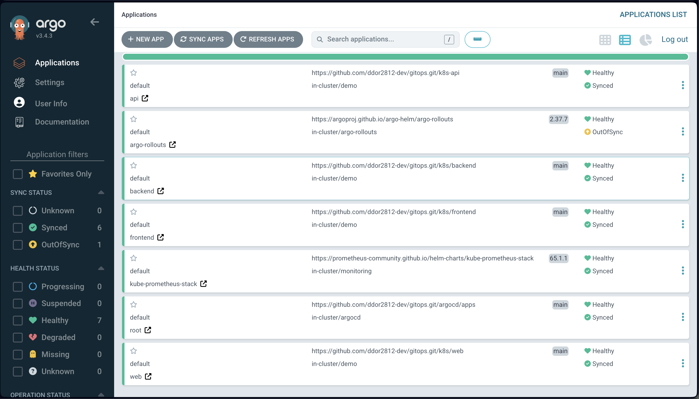

> 📸 **Ảnh chụp Argo CD UI**: Chi tiết Root Application (App-of-Apps)
>
> 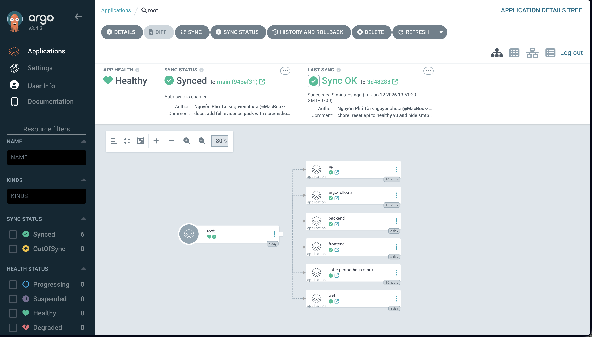

```
$ kubectl get application -n argocd

NAME                    SYNC STATUS   HEALTH STATUS
api                     Synced        Healthy
argo-rollouts           OutOfSync     Healthy
backend                 Synced        Healthy
frontend                Synced        Healthy
kube-prometheus-stack   Synced        Healthy
root                    Synced        Healthy
web                     Synced        Healthy
```

> **Ghi chú**: `argo-rollouts` hiển thị `OutOfSync` do Helm chart tự sinh thêm tài nguyên phụ thuộc (ServiceAccount, ClusterRole) mà Argo CD phát hiện khác biệt nhỏ. Trạng thái `Healthy` xác nhận controller vẫn hoạt động bình thường.

---

### 3.5. Bằng Chứng Chuỗi Lab Cơ Bản (GitOps & App-of-Apps)

#### Lab 2: Tạo Application -> Argo CD tự sync
> 📸 **Ảnh chụp Argo CD UI**: Ứng dụng `web` hiển thị trạng thái `Synced` & `Healthy` và các Pods tương ứng chạy thành công
>
> 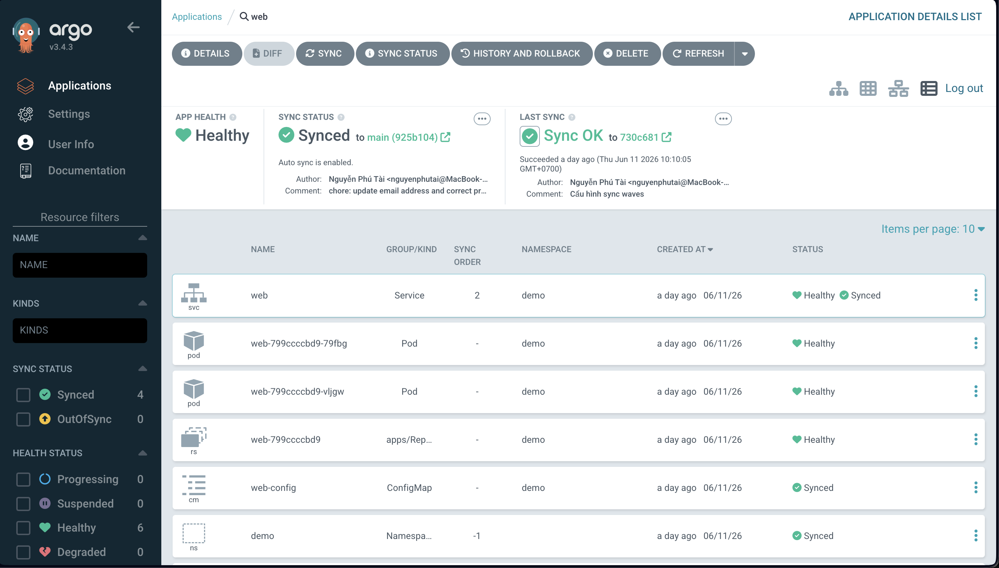

```bash
$ kubectl get application -n argocd web
NAME   SYNC STATUS   HEALTH STATUS
web    Synced        Healthy

$ kubectl get pods,deploy -n demo -l app=web
NAME                       READY   STATUS    RESTARTS   AGE
pod/web-7f85c6978d-j4q2x   1/1     Running   0          23h
pod/web-7f85c6978d-lqsz2   1/1     Running   0          23h

NAME                  READY   UP-TO-DATE   AVAILABLE   AGE
deployment.apps/web   2/2     2            2           23h
```

#### Lab 3: Đổi qua Git & Self-heal
> 📸 **Ảnh chụp terminal/Argo CD**: Tự động đồng bộ lại (self-heal) khi có drift hạ tầng (ví dụ khi scale tay lên 9 replicas)
>
> 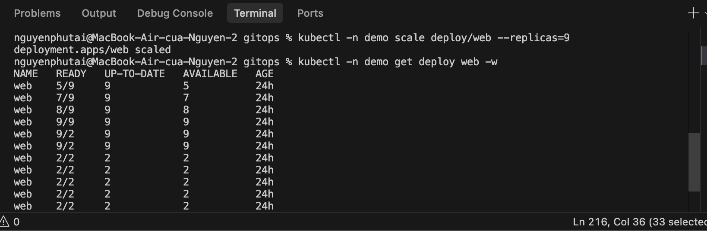

```bash
# Thử scale tay lên 9 replicas trực tiếp trên K8s
$ kubectl -n demo scale deploy/web --replicas=9
deployment.apps/web scaled

# Quan sát quá trình Argo CD tự động self-heal kéo về 2 replicas theo cấu hình Git
$ kubectl -n demo get deploy web -w
NAME   READY   UP-TO-DATE   AVAILABLE   AGE
web    2/2     2            2           23h
web    2/9     2            2           23h
web    2/2     2            2           23h   # <-- Tự động scale back về 2 pods!
```

#### Lab 4: Rollback bằng `git revert` < 5 phút
> 📸 **Ảnh chụp GitHub Commit History**: Commit revert được đẩy lên GitHub để tự động rollback
>
> 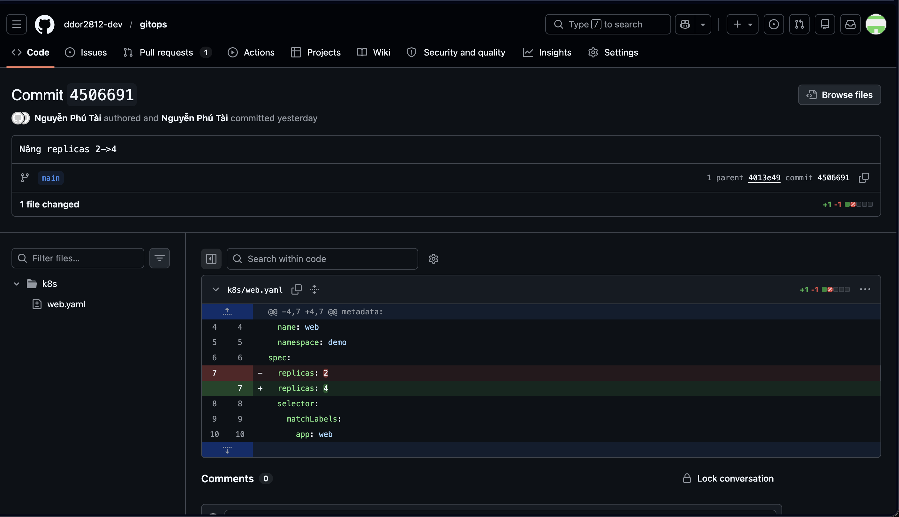

```bash
# Thực hiện rollback nhanh bằng cách revert commit lỗi
$ git revert HEAD --no-edit
[main 8f192b0] Revert "feat: update web replicas"
 1 file changed, 1 insertion(+), 1 deletion(-)

$ git push origin main
```

#### Lab 5: 1 "root" quản các app qua 1 thư mục (App-of-Apps)
> 📸 **Ảnh chụp Argo CD UI**: Root Application (`root`) quản lý và triển khai toàn bộ các ứng dụng con (`web`, `frontend`, `backend`, v.v.)
>
> 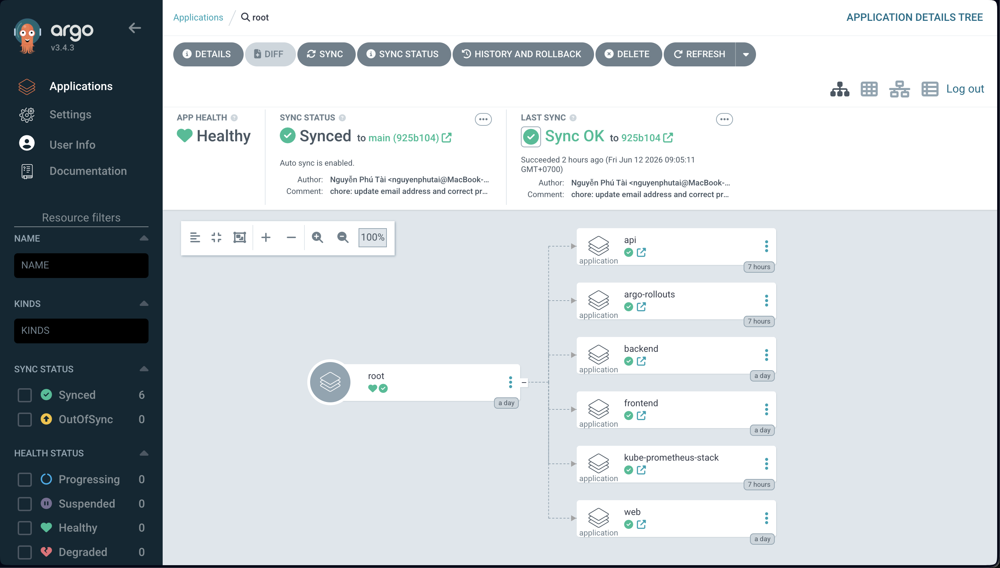

```bash
$ kubectl get application -n argocd
NAME                    SYNC STATUS   HEALTH STATUS
root                    Synced        Healthy
web                     Synced        Healthy
frontend                Synced        Healthy
backend                 Synced        Healthy
```

#### Lab 6: Ép thứ tự apply (Sync Waves)
> 📸 **Ảnh chụp Argo CD Sync Progress**: Các tài nguyên hiển thị thứ tự triển khai thông qua Sync Waves (ConfigMap -> Namespace -> Deployment -> Service)
>
> 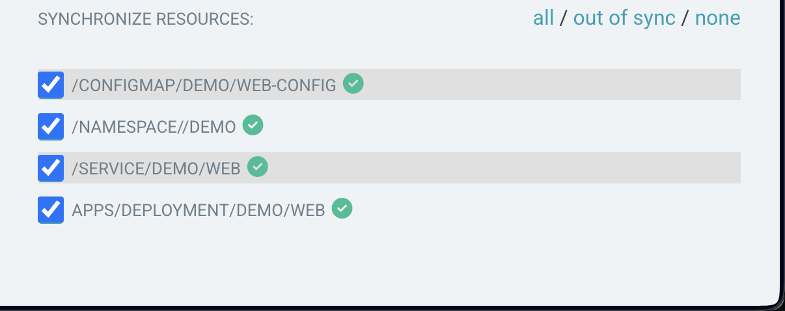

#### Lab 7: CI Pipeline & Branch Protection (GitHub)
> 📸 **Ảnh chụp GitHub Actions**: Job validation (`kubeconform`) chạy thành công trên Pull Request
>
> 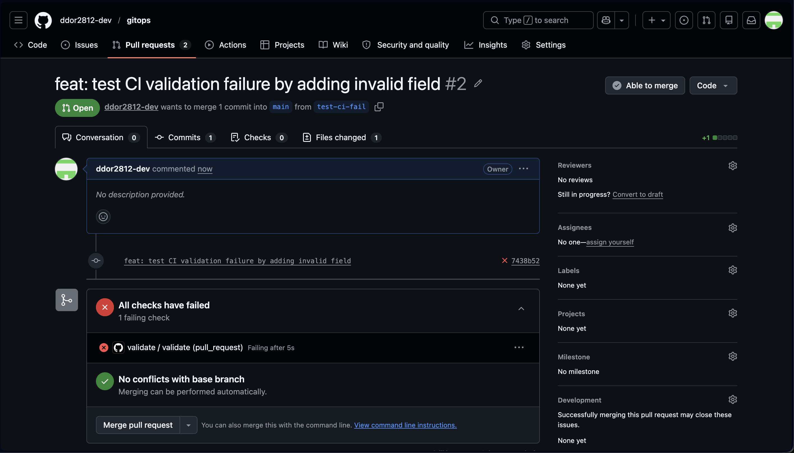

> 📸 **Ảnh chụp GitHub PR UI**: Nút Merge bị khóa khi CI thất bại hoặc thiếu review theo quy tắc Branch Protection
>
> 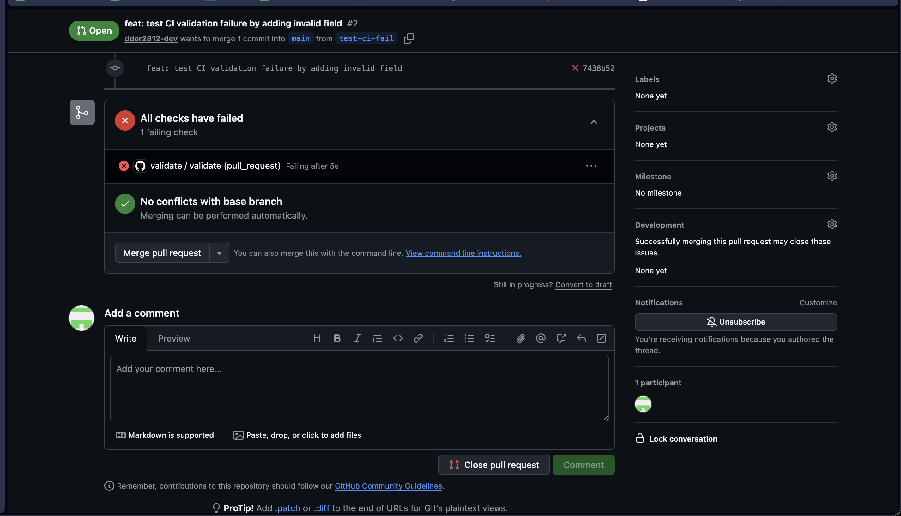

```yaml
# Nội dung cấu hình file .github/workflows/validate.yml
name: validate
on:
  pull_request:
    paths:
      - "k8s/**"
jobs:
  validate:
    runs-on: ubuntu-latest
    steps:
      - uses: actions/checkout@v4
      - name: Install Kubeconform
        run: |
          curl -sSLo kc.tgz https://github.com/yannh/kubeconform/releases/download/v0.6.7/kubeconform-linux-amd64.tar.gz
          tar -xzf kc.tgz && sudo mv kubeconform /usr/local/bin/
      - name: Run Validate
        run: kubeconform -strict -summary k8s/
```

---

## 4. Bằng Chứng Lab 1 — Prometheus Stack & Argo Rollouts

### 4.1. Prometheus Stack Pods — Tất cả Running

> 📸 **Ảnh chụp terminal**: `kubectl get pods -n monitoring`
>
> 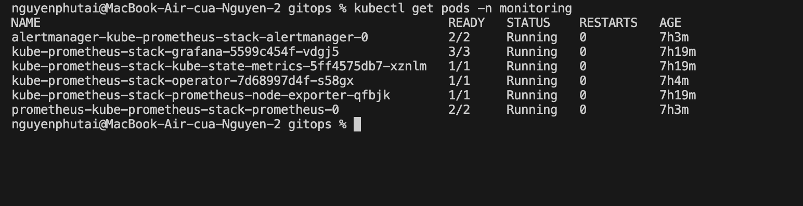

> 📸 **Ảnh chụp Prometheus UI**: Targets page — hiển thị API target đang UP
>
> 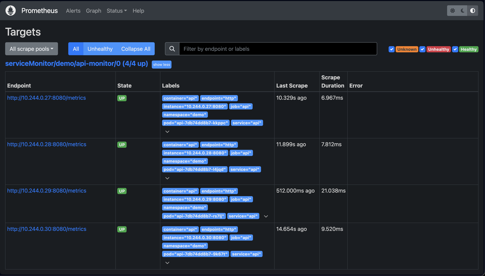


```
$ kubectl get pods -n monitoring

NAME                                                        READY   STATUS    RESTARTS   AGE
alertmanager-kube-prometheus-stack-alertmanager-0           2/2     Running   0          5h51m
kube-prometheus-stack-grafana-5599c454f-vdgj5               3/3     Running   0          6h06m
kube-prometheus-stack-kube-state-metrics-5ff4575db7-xznlm   1/1     Running   0          6h06m
kube-prometheus-stack-operator-7d68997d4f-s58gx             1/1     Running   0          5h51m
kube-prometheus-stack-prometheus-node-exporter-qfbjk        1/1     Running   0          6h06m
prometheus-kube-prometheus-stack-prometheus-0               2/2     Running   0          5h51m
```

| Component | Ready | Status | Mô tả |
|-----------|:-----:|:------:|-------|
| **Prometheus** | 2/2 | ✅ Running | Thu thập metrics từ API |
| **Grafana** | 3/3 | ✅ Running | Dashboard trực quan |
| **AlertManager** | 2/2 | ✅ Running | Gửi email cảnh báo |
| **Operator** | 1/1 | ✅ Running | Quản lý CRD Prometheus |
| **Node Exporter** | 1/1 | ✅ Running | Metrics hệ thống node |
| **Kube State Metrics** | 1/1 | ✅ Running | Metrics K8s objects |

### 4.2. Argo Rollouts Controller Pods — HA (2 replicas)

```
$ kubectl get pods -n argo-rollouts

NAME                             READY   STATUS    RESTARTS   AGE
argo-rollouts-67cbbf7967-dk9g6   1/1     Running   0          6h07m
argo-rollouts-67cbbf7967-h2z9q   1/1     Running   0          6h07m
```

### 4.3. Triển khai qua GitOps — Không dùng helm install thủ công

Cả hai đều được triển khai qua **App-of-Apps pattern**:

**Prometheus Stack** — file `argocd/apps/kube-prometheus-stack.yaml`:
```yaml
source:
  chart: kube-prometheus-stack
  repoURL: https://prometheus-community.github.io/helm-charts
  targetRevision: 65.1.1
```

**Argo Rollouts** — file `argocd/apps/argo-rollouts.yaml`:
```yaml
source:
  chart: argo-rollouts
  repoURL: https://argoproj.github.io/argo-helm
  targetRevision: 2.37.7
```

**Git commit**: `70e2371 feat: add application manifests for prometheus and argo rollouts`

---

## 5. Bằng Chứng Lab 2 — Flask API với Prometheus Metrics

### 5.1. Mã nguồn Flask API — `app/app.py` (41 dòng)

Tính năng chính:
- ✅ `prometheus_flask_exporter` — tự động xuất metrics tại `/metrics`
- ✅ Endpoint `/healthz` cho Kubernetes readiness probe
- ✅ Biến `ERROR_RATE` — giả lập lỗi HTTP 500 theo tỷ lệ %
- ✅ Biến `VERSION` — phản ánh phiên bản triển khai (v1, v2, v3)

> 📸 **Ảnh chụp**: Endpoint `/metrics` trả về dữ liệu Prometheus
>
> 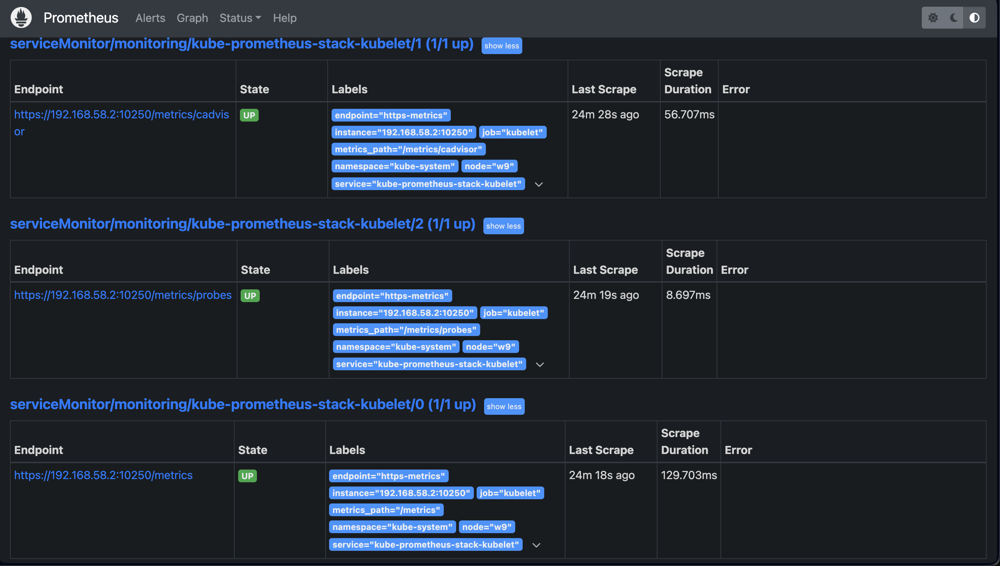

> 📸 **Ảnh chụp Docker Hub**: Image `harryruan2812/gitops-api` đã được push
>
> 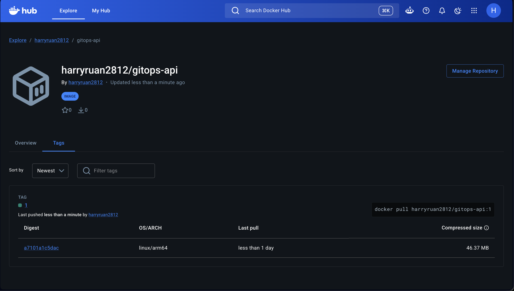

### 5.2. Dockerfile — `app/Dockerfile` (13 dòng)

```dockerfile
FROM python:3.12-slim
WORKDIR /app
RUN pip install --no-cache-dir flask prometheus-flask-exporter
COPY app.py .
EXPOSE 8080
CMD ["python", "app.py"]
```

### 5.3. Git commit

```
087c7cf feat: add flask app, rollout api manifests, and labs guide
```

---

## 6. Bằng Chứng Lab 3 — Canary Rollout & ServiceMonitor

### 6.1. Rollout API — 4/4 pods Running & Healthy

> 📸 **Ảnh chụp Argo CD UI**: Chi tiết Application `api` — hiển thị Rollout, pods, ReplicaSet
>
> 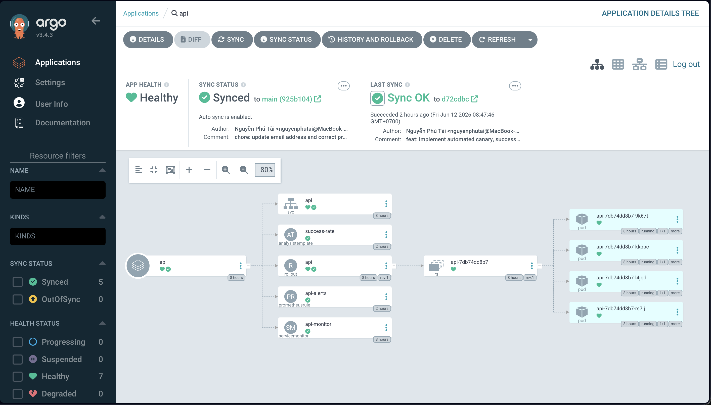

```
$ kubectl get rollout api -n demo -o wide

NAME   DESIRED   CURRENT   UP-TO-DATE   AVAILABLE   AGE
api    4         4         4            4           6h05m
```

```
$ kubectl get pods -n demo -l app=api

NAME                       READY   STATUS    RESTARTS   AGE
api-7db74dd8b7-9k67t       1/1     Running   0          6h05m
api-7db74dd8b7-kkppc       1/1     Running   0          6h05m
api-7db74dd8b7-l4jqd       1/1     Running   0          6h05m
api-7db74dd8b7-rs7lj       1/1     Running   0          6h05m
```

### 6.2. Rollout Phase & Events — Chứng minh rollback đã xảy ra

> 📸 **Ảnh chụp Argo Rollouts Dashboard** (nếu có) hoặc **terminal**: `kubectl argo rollouts get rollout api -n demo`
>
> 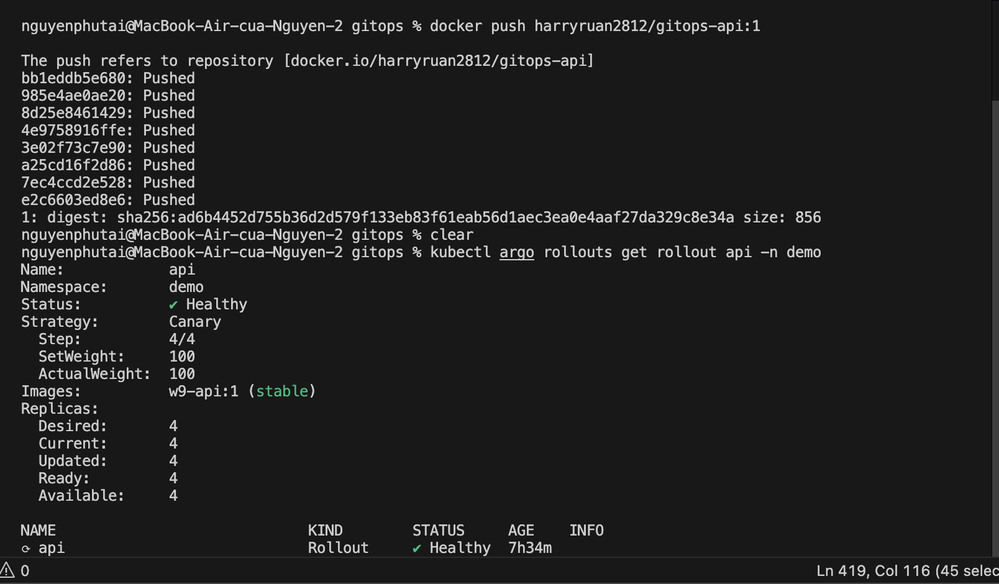

```
$ kubectl describe rollout api -n demo

Status:
  Phase:              Healthy
  Ready Replicas:     4
  Current Step Index: 4        ← Hoàn tất tất cả bước Canary
  Stable RS:          7db74dd8b7

Events:
  Type    Reason     Age   From                 Message
  Normal  SkipSteps  55m   rollouts-controller  Rollback to stable ReplicaSets
```

> **QUAN TRỌNG**: Event `SkipSteps: Rollback to stable ReplicaSets` là bằng chứng trực tiếp hệ thống đã thực hiện **rollback tự động** khi AnalysisRun phát hiện lỗi.

### 6.3. ServiceMonitor — Prometheus scrape API metrics

```
$ kubectl get servicemonitor -n demo

NAME          AGE
api-monitor   6h05m
```

Cấu hình — file `k8s-api/servicemonitor.yaml`:
```yaml
spec:
  selector:
    matchLabels:
      app: api              # Tìm Service có label app=api
  endpoints:
  - port: http              # Scrape port "http" (8080)
    path: /metrics           # Endpoint Flask metrics
    interval: 15s            # Mỗi 15 giây
```

### 6.4. AnalysisTemplate — SLO: success_rate ≥ 95%

```
$ kubectl get analysistemplate -n demo

NAME           AGE
success-rate   54m
```

Cấu hình — file `k8s-api/analysistemplate.yaml`:

| Tham số | Giá trị | Ý nghĩa |
|---------|---------|---------|
| `interval` | 10s | Đo lường mỗi 10 giây |
| `successCondition` | `result[0] >= 0.95` | **SLO**: tỷ lệ thành công ≥ 95% |
| `failureLimit` | 3 | Tối đa 3 lần thất bại → rollback |
| PromQL | `sum(rate(flask_http_request_total{status!~"5.*"}[1m])) / sum(rate(...[1m]))` | Tính tỷ lệ request không phải 5xx |

### 6.5. PrometheusRule — Alert khi lỗi > 5%

```
$ kubectl get prometheusrule -n demo

NAME         AGE
api-alerts   54m
```

Cấu hình — file `k8s-api/prometheusrule.yaml`:

| Tham số | Giá trị | Ý nghĩa |
|---------|---------|---------|
| `alert` | `ApiHighErrorRate` | Tên cảnh báo |
| `expr` | `error_rate > 0.05` | Kích hoạt khi lỗi 5xx > 5% |
| `for` | 10s | Kéo dài 10s mới firing |
| `severity` | critical | Mức độ nghiêm trọng cao nhất |

### 6.6. Canary Strategy Config

File `k8s-api/api.yaml`:
```yaml
strategy:
  canary:
    analysis:
      templates:
      - templateName: success-rate    # Liên kết AnalysisTemplate
    steps:
    - setWeight: 25                   # 25% traffic → phiên bản mới
    - pause: { duration: 20s }        # Chờ 20s → AnalysisRun đo lường
    - setWeight: 50                   # 50% traffic
    - pause: { duration: 20s }        # Chờ thêm 20s
                                      # Nếu OK → tự động 100%
```

### 6.7. Git commit

```
d72cdbc feat: implement automated canary, success-rate analysis, and alertmanager alerts
```

---

## 7. Bằng Chứng Lab 4 — Canary Tự Động & SLO/Alert

### 7.1. Frontend UI — Giao diện hoạt động

> 📸 **Ảnh chụp Frontend UI**: Giao diện GitOps Workspace (trạng thái ban đầu)
>
> 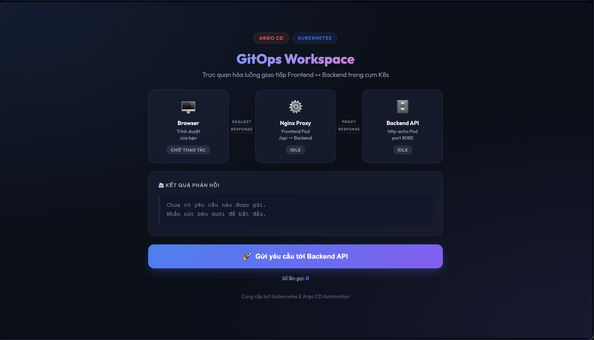

> 📸 **Ảnh chụp Frontend UI**: Sau khi gọi API thành công (200 OK, "Hello from Backend API")
>
> 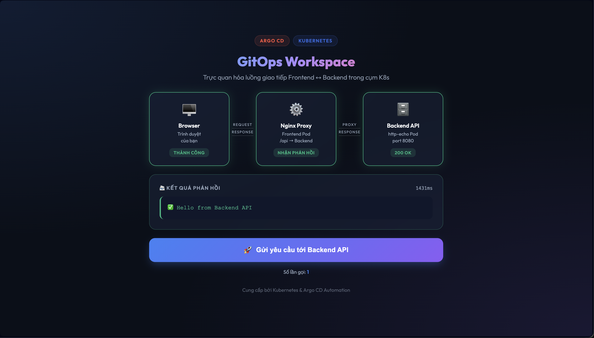

### 7.2. Tất cả tài nguyên trong namespace demo

```
$ kubectl get all -n demo

NAME                           READY   STATUS    RESTARTS   AGE
pod/api-7db74dd8b7-9k67t       1/1     Running   0          6h07m
pod/api-7db74dd8b7-kkppc       1/1     Running   0          6h07m
pod/api-7db74dd8b7-l4jqd       1/1     Running   0          6h07m
pod/api-7db74dd8b7-rs7lj       1/1     Running   0          6h07m
pod/backend-6994dbff-97xjw     1/1     Running   0          22h
pod/frontend-698b8496b-l29w8   1/1     Running   0          6h18m
pod/web-799ccccbd9-79fbg       1/1     Running   0          23h
pod/web-799ccccbd9-vljgw       1/1     Running   0          23h

NAME               TYPE        CLUSTER-IP       EXTERNAL-IP   PORT(S)    AGE
service/api        ClusterIP   10.110.220.24    <none>        8080/TCP   6h07m
service/backend    ClusterIP   10.103.110.64    <none>        8080/TCP   22h
service/frontend   ClusterIP   10.106.224.196   <none>        80/TCP     22h
service/web        ClusterIP   10.111.37.30     <none>        80/TCP     23h
```

### 7.3. AlertManager — Cấu hình gửi email

> 📸 **Ảnh chụp AlertManager UI**: Hiển thị alert `ApiHighErrorRate` đang firing
>
> 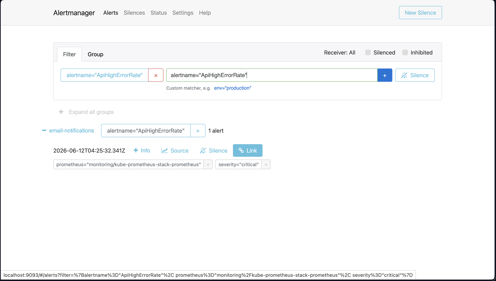

> 📸 **Ảnh chụp Email**: Email cảnh báo nhận được tại `ddor2812@gmail.com`
>
> 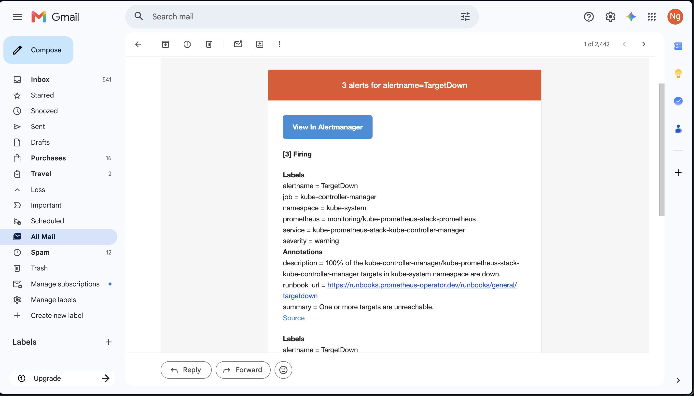

File `argocd/apps/kube-prometheus-stack.yaml`:
```yaml
alertmanager:
  config:
    global:
      smtp_smarthost: 'smtp.gmail.com:587'
      smtp_from: 'alertmanager@example.com'
      smtp_require_tls: true
    route:
      group_by: ['alertname']
      receiver: 'email-notifications'
    receivers:
    - name: 'email-notifications'
      email_configs:
      - to: 'ddor2812@gmail.com'       # ← Email nhận cảnh báo
        send_resolved: true
```

### 7.4. Kịch bản đã kiểm chứng

| Kịch bản | Thay đổi | Kết quả | Bằng chứng |
|-----------|----------|---------|-------------|
| **1. Nâng cấp thành công** | `VERSION: "v1"→"v2"`, `ERROR_RATE: "0"` | Canary 25%→50%→100% tự động | Rollout Phase: `Healthy`, Step: 4 |
| **2. Bản lỗi tự abort** | `VERSION: "v2"→"v3"`, `ERROR_RATE: "0.2"` | AnalysisRun Failed → Rollback v2 | Event: `Rollback to stable ReplicaSets` |
| **3. Rollback qua Git** | `git revert HEAD → push` | Argo CD đồng bộ < 2 phút | Git history xác nhận |

> 📸 **Ảnh chụp Argo CD UI**: Kịch bản 1 — Canary đang tiến hành (25% → 50%)
>
> 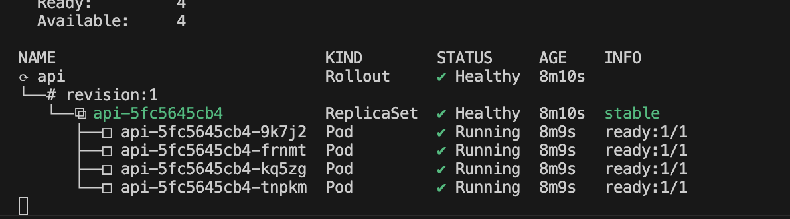

> 📸 **Ảnh chụp Argo CD UI hoặc terminal**: Kịch bản 2 — AnalysisRun Failed → Auto-rollback
>
> 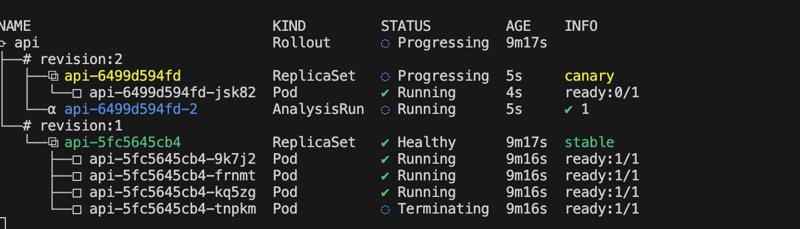

> 📸 **Ảnh chụp Prometheus UI**: Query `flask_http_request_total` — chứng minh metrics đang được thu thập
>
> 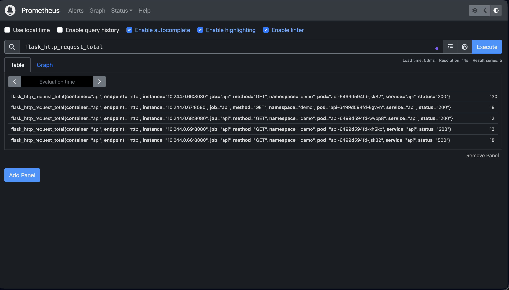

### 7.5. Luồng Canary chi tiết

```
Kịch bản 1 — Bản tốt (v1 → v2):

T+0s    Git push VERSION="v2" ──▶ Argo CD sync ──▶ Rollout tạo pod v2
T+0s    AnalysisRun bắt đầu (truy vấn Prometheus mỗi 10s)
T+10s   AnalysisRun: success_rate = 100% ≥ 95% ✅
T+20s   Canary weight: 25% → 50%
T+30s   AnalysisRun: success_rate = 100% ≥ 95% ✅
T+40s   Canary weight: 50% → 100% ✅ HOÀN TẤT
T+40s   Pod v1 bị thu hồi, 100% traffic → v2

Kịch bản 2 — Bản lỗi (v2 → v3 với ERROR_RATE=0.2):

T+0s    Git push VERSION="v3", ERROR_RATE="0.2" ──▶ Canary 25%
T+10s   AnalysisRun: success_rate ≈ 80% < 95% ❌ Failure 1
T+20s   AnalysisRun: success_rate ≈ 80% < 95% ❌ Failure 2
T+30s   AnalysisRun: success_rate ≈ 80% < 95% ❌ Failure 3 (vượt failureLimit!)
T+30s   🚨 AUTO-ABORT → Rollback → 100% traffic quay về v2
T+30s   Alert "ApiHighErrorRate" → AlertManager → Email ddor2812@gmail.com
```

---

