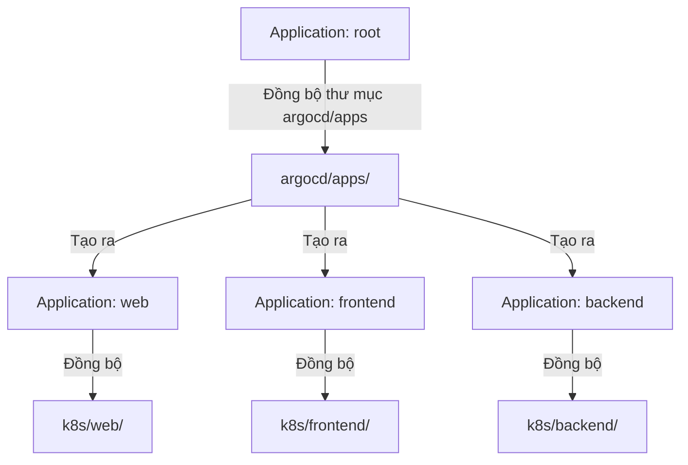
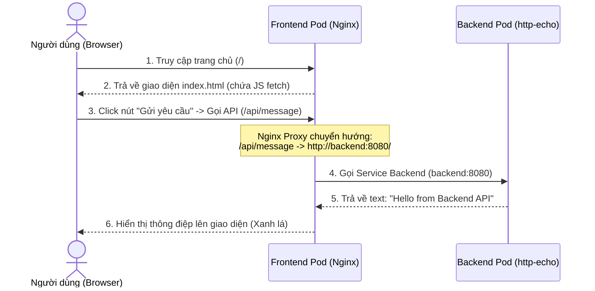

# Tài Liệu Dự Án GitOps (Mô hình App-of-Apps)

Dự án này sử dụng mô hình GitOps kết hợp với công cụ **Argo CD** để triển khai tự động các ứng dụng lên cụm Kubernetes. Kiến trúc này được tổ chức theo mô hình **App-of-Apps (Ứng dụng của các ứng dụng)** giúp quản lý tập trung toàn bộ hệ thống từ một điểm duy nhất.

---

## 📂 Cấu Trúc Thư Mục Dự Án

Cấu trúc thư mục được thiết kế khoa học nhằm tách biệt cấu hình Argo CD và các tài nguyên Kubernetes:

```text
├── README.md                 # Tài liệu hướng dẫn chi tiết của dự án
├── argocd/                   # Thư mục cấu hình Argo CD
│   ├── root.yaml             # Root Application (Ứng dụng gốc quản lý các ứng dụng con)
│   └── apps/                 # Chứa khai báo các ứng dụng con
│       ├── web.yaml          # Ứng dụng Web cũ (Nginx đơn giản)
│       ├── frontend.yaml     # Ứng dụng Frontend (Nginx UI + Proxy)
│       └── backend.yaml      # Ứng dụng Backend (Mock API trả về message)
└── k8s/                      # Thư mục chứa tài nguyên Kubernetes thực tế
    ├── web/                  # Tài nguyên Kubernetes cho Web cũ
    │   ├── namespace.yaml    # Khai báo Namespace 'demo'
    │   └── web.yaml          # ConfigMap, Deployment, Service cho Web cũ
    ├── frontend/             # Tài nguyên Kubernetes cho Frontend
    │   └── frontend.yaml     # ConfigMap (HTML & Nginx Proxy), Deployment, Service
    └── backend/              # Tài nguyên Kubernetes cho Backend
        └── backend.yaml      # ConfigMap, Deployment (http-echo), Service
```

---

## 🏗️ Nguyên Lý Hoạt Động (Mô hình App-of-Apps)

Mô hình **App-of-Apps** cho phép chúng ta quản lý nhiều ứng dụng bằng cách khai báo một **Root Application** duy nhất trong Argo CD.



1. **Root Application (`root.yaml`)**:
   - Theo dõi thư mục `argocd/apps` trên nhánh `main` của kho lưu trữ Git.
   - Khi phát hiện có file cấu hình `Application` mới hoặc thay đổi trong thư mục này, Root Application sẽ tự động tạo và quản lý các ứng dụng con đó trên Kubernetes.

2. **Các ứng dụng con (`web.yaml`, `frontend.yaml`, `backend.yaml`)**:
   - Mỗi ứng dụng con theo dõi một thư mục tài nguyên Kubernetes tương ứng trong `k8s/` (ví dụ: `k8s/frontend`).
   - Khi code hoặc manifest của ứng dụng con thay đổi trên Git, Argo CD của ứng dụng đó sẽ tự động cập nhật các tài nguyên Kubernetes thực tế (Pod, Service, ConfigMap).

---

## 🌊 Cơ Chế Sync Waves (Làn sóng đồng bộ)

Để đảm bảo các tài nguyên được khởi tạo theo đúng thứ tự (ví dụ: tạo Namespace trước, tạo ConfigMap rồi mới tạo Deployment để tránh lỗi thiếu cấu hình), dự án sử dụng tính năng **Sync Waves** của Argo CD bằng annotation `argocd.argoproj.io/sync-wave`.

Thứ tự triển khai như sau:

| Sync Wave | Loại tài nguyên | Ví dụ thực tế | Mô tả |
| :---: | :--- | :--- | :--- |
| **`-1`** | Namespace | `Namespace (demo)` | Tạo namespace chứa các tài nguyên trước tiên. |
| **`0`** | ConfigMap / Secret | `ConfigMap (frontend-config)` | Chuẩn bị sẵn cấu hình cấu trúc hoặc mã nguồn HTML. |
| **`1`** | Deployment / StatefulSet | `Deployment (frontend, backend)` | Khởi tạo Pod ứng dụng và đọc cấu hình từ ConfigMap. |
| **`2`** | Service / Ingress | `Service (frontend, backend)` | Mở cổng kết nối để các dịch vụ giao tiếp với nhau. |

---

## 🔄 Luồng Giao Tiếp Giữa Frontend và Backend

Ứng dụng Frontend và Backend giao tiếp với nhau hoàn toàn khép kín bên trong cụm Kubernetes bằng cơ chế **Nginx Reverse Proxy**:



1. **Frontend** chứa một máy chủ Nginx được cấu hình trong `nginx.conf`:
   - Khi người dùng truy cập vào trang chủ (`/`), Nginx sẽ trả về file `index.html` (giao diện điều khiển đẹp mắt).
   - Khi script JavaScript trong trang gọi API tới `/api/message`, Nginx sẽ bắt lấy yêu cầu này và định tuyến qua mạng nội bộ K8s tới địa chỉ `http://backend:8080/` (Service của Backend).
2. **Backend** sử dụng container image `hashicorp/http-echo` siêu nhẹ, lắng nghe yêu cầu tại cổng `8080` của Service `backend` và phản hồi nội dung văn bản: *"Hello from Backend API"*.
3. **Kết quả**: Browser của người dùng không cần kết nối trực tiếp đến Backend, giúp bảo mật API và tránh lỗi CORS (Cross-Origin Resource Sharing).

---

## 🚀 Hướng Dẫn Triển Khai & Kiểm Tra

### Bước 1: Khởi tạo Root App trên Cluster
Khai báo ứng dụng Root lên Argo CD bằng lệnh:
```bash
kubectl apply -f argocd/root.yaml
```

### Bước 2: Đẩy code lên nhánh main
Hãy commit toàn bộ thay đổi thư mục và đẩy lên nhánh `main` trên GitHub:
```bash
git add .
git commit -m "feat: restructure k8s and implement frontend-backend with sync waves"
git push origin main
```

### Bước 3: Đồng bộ và kiểm tra trạng thái
1. Mở giao diện Argo CD UI, bạn sẽ thấy ứng dụng `root` tự động phát hiện và sinh ra 3 ứng dụng con: `web`, `frontend`, và `backend`.
2. Kiểm tra các Pod và Service trong namespace `demo` đã sẵn sàng hoạt động hay chưa:
   ```bash
   kubectl get all -n demo
   ```

### Bước 4: Kiểm tra hoạt động của ứng dụng
Để truy cập ứng dụng dưới máy cá nhân (Localhost), hãy tạo kết nối Port-forward tới service Frontend:
```bash
kubectl port-forward svc/frontend -n demo 8080:80
```
Sau đó, mở trình duyệt web và truy cập địa chỉ: [http://localhost:8080](http://localhost:8080). Hãy nhấn nút **"Gửi yêu cầu tới Backend API"** để kiểm tra tính năng kết nối trực tiếp giữa hai ứng dụng.
